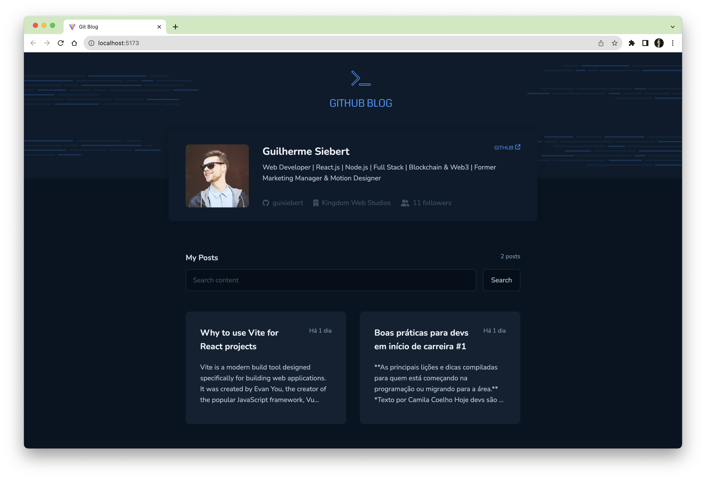

# GitBlog
GitBlog is a web application that serves as a blogging platform. It utilizes a GitHub repository's issues as a database, treating each issue as an individual article. Users can browse and read articles, as well as create and submit new articles by creating issues on the associated GitHub repository.



## Technologies Used

- React
- TypeScript
- Axios
- React DOM
- Styled Components
- React Markdown

## Features and Challenges

### TypeScript

The use of TypeScript ensures type safety and improves the development experience by providing static type checking. It helps catch potential errors during development and enhances code maintainability.

### Axios

Axios is used to read data from HubSpot's API, allowing you to fetch additional information or integrate external data sources into your blog posts. By leveraging Axios, you can easily handle HTTP requests and retrieve data from HubSpot or other APIs.

### React DOM

React DOM is utilized to create routes for each blog post. This allows for dynamic routing within the application, enabling users to access individual blog posts by their respective URLs. It provides a seamless navigation experience for readers.

### Styled Components

Styled Components is employed for styling the components in the application. It allows you to write CSS directly within your JavaScript code, providing a convenient way to encapsulate styles and manage component-specific styling. Styled Components promotes modularity and reusability in your styling approach.

### React Markdown

React Markdown is used to convert the Markdown content of each blog post into a format that React can render. It enables you to write articles in Markdown format, which is a popular and easy-to-use markup language for writing rich-text content.

## Getting Started

To run the application locally, follow these steps:

1. Clone the repository:

```bash
git clone https://github.com/your_username/your_repository.git
```

2. Navigate to the project directory:

```bash
cd your_repository
```

3. Install the dependencies:

```bash
npm install
```

4. Start the development server:

```bash
npm run dev
```

This will start the React development server.

5. Open your browser and visit `http://localhost:5173` to see the application in action.